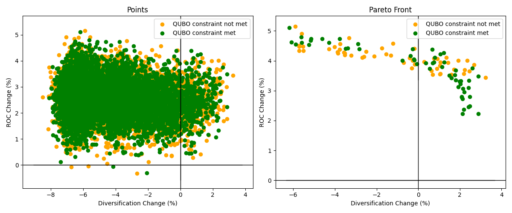

# Portfolio optimization

Real-world investment decisions involve multiple, often conflicting, objectives that needs to be balanced.
Primary goals typically revolve around maximizing returns while minimizing risks.
At the same time, one might want to require additional constraints such as demanding a minimum carbon footprint reduction. 
Finding a portfolio that balances these objectives is a challenging task and can be solved using multi-objective portfolio optimization. 

This repository provides Python code that converts the multi-objective portfolio optimization problem
into a [QUBO](https://en.wikipedia.org/wiki/Quadratic_unconstrained_binary_optimization) problem. The transformed problem can then be solved using quantum annealing techniques.

The following objectives can be considered

- `return on capital`, indicated by `ROC`,
- `diversification`, indicated by the [Herfindahl-Hirschman Index](https://en.wikipedia.org/wiki/Herfindahl%E2%80%93Hirschman_inde) `HHI`.

Additionally, we allow for a capital growth factor and arbitrary emission reduction constraints to be considered.

The `Pareto front`, the set of solutions where one objective can't be improved without worsening the other objective,
can be computed for the objectives return on capital and diversification. 

The codebase is based on the following paper:

- [Aguilera et al., - Multi-objective Portfolio Optimisation Using the Quantum Annealer (2024)](https://www.mdpi.com/2227-7390/12/9/1291)

**Funding:** This research was funded by Rabobank and Stichting TKI High Tech Systems
and Materials, under a program by Brightland's Techruption.

*Limitations in (end-)use: the content of this software package may solely be used for applications that comply with international export control laws.*

## Documentation

Documentation of the `tno.quantum.problems.portfolio_optimization` package can be found [here](https://tno-quantum.github.io/problems.portfolio_optimization/).

## Install

Easily install the `tno.quantum.problems.portfolio_optimization` package using pip:

```console
$ python -m pip install tno.quantum.problems.portfolio_optimization
```

If you wish to use D-Wave quantum hardware:
```console
$ python -m pip install 'tno.quantum.problems.portfolio_optimization[quantum]'
```

If you wish to run the tests you can use:
```console
$ python -m pip install 'tno.quantum.problems.portfolio_optimization[tests]'
```

## Usage

<details>
  <summary>Solve portfolio optimization problem.</summary>

Here's an example of how the `PortfolioOptimizer` class can be used to define an portfolio optimization problem,
and subsequently, how the Pareto front can be computed using the simulated annealing sampler from D-Wave. 

```python
import numpy as np
from dwave.samplers import SimulatedAnnealingSampler

from tno.quantum.problems.portfolio_optimization import PortfolioOptimizer

# Choose sampler for solving qubo
sampler = SimulatedAnnealingSampler()
sampler_kwargs = {"num_reads": 20, "num_sweeps": 200}

# Set up penalty coefficients for the constraints
lambdas1 = np.logspace(-16, 1, 25, endpoint=False, base=10.0)
lambdas2 = np.logspace(-16, 1, 25, endpoint=False, base=10.0)
lambdas3 = np.array([1])

# Create portfolio optimization problem
portfolio_optimizer = PortfolioOptimizer("benchmark_dataset")
portfolio_optimizer.add_minimize_hhi(weights=lambdas1)
portfolio_optimizer.add_maximize_roc(formulation=1, weights_roc=lambdas2)
portfolio_optimizer.add_emission_constraint(
   weights=lambdas3,
   emission_now="emis_intens_now",
   emission_future="emis_intens_future",
   name="emission"
)

# Solve the portfolio optimization problem
results = portfolio_optimizer.run(sampler, sampler_kwargs)
```
</details>

<details>
  <summary>Visualize results.</summary>

The results can be inspected in more detail by looking at the Pandas results DataFrame
`results.results_df`.

Alternatively, the results can be plotted in a `(Diversification, ROC)`-graph. The
following example first slices the results in data points that do and do not satisfy the
constraints using the method `slice_results`. 

Note that:

- Individual data points can subsequently be plotted using the `plot_points` function.
- The Pareto front can be plotted using the `plot_front` function.

```python
import matplotlib.pyplot as plt

from tno.quantum.problems.portfolio_optimization import plot_front, plot_points

(x1, y1), (x2, y2) = results.slice_results()
fig, (ax1, ax2) = plt.subplots(ncols=2, figsize=(12, 5))

# Plot data points
plot_points(x2, y2, color="orange", label="QUBO constraint not met", ax=ax1)
plot_points(x1, y1, color="green", label="QUBO constraint met", ax=ax1)
ax1.set_title("Points")

# Plot Pareto front
plot_front(x2, y2, color="orange", label="QUBO constraint not met", ax=ax2)
plot_front(x1, y1, color="green", label="QUBO constraint met", ax=ax2)
ax2.set_title("Pareto Front")
fig.tight_layout()
plt.show()
```

</details>




More elaborate examples can be found in our [examples repository](https://github.com/TNO-Quantum/examples ).

Data input
----------

The data used for the portfolio optimization can be imported via an excel file, csv file,
json file or as a Pandas DataFrame.
The data needs to contain at least the following columns:

- `asset`: The name of the asset.
- `outstanding_now`: Current outstanding amount per asset.
- `min_outstanding_future`: Lower bound outstanding amount in the future per asset.
- `max_outstanding_future`: Upper bound outstanding amount in the future per asset.
- `income_now`: Current income per asset, corresponds to return multiplied by the current outstanding amount.
- `regcap_now`: Current regulatory capital per asset.


If the input datafile contains all the correct information, but has different column
names, it is possible to rename the columns without altering the input file.
Details and examples can be found in the [documentation]((https://tno-quantum.github.io/problems.portfolio_optimization/)).

The data that was used for the publication can be found in the `tno/quantum/problems/portfolio_optimization/datasets/` folder.


Using Quantum Annealing Solvers
-------------------------------

By default, the portfolio optimization QUBO is solved using simulated annealing.
Any D-Wave ``Sampler`` is however supported and can be provided to the `PortfolioOptimizer.run` method.
 

Below is an example how to initialise a quantum annealing sampler that uses `100` micro seconds annealing time per sample.
The example assumes a proper [configuration setup](https://docs.ocean.dwavesys.com/en/stable/overview/sapi.html) to the D-Wave's Solver API.

```python
from dwave.system import DWaveSampler, LazyFixedEmbeddingComposite

# Define QPU D-Wave Sampler
qpu = DWaveSampler()
sampler = LazyFixedEmbeddingComposite(qpu)
sampler_kwargs = {"annealing_time": 100}
```

We refer to the [D-Wave Sampler documentation](https://docs.ocean.dwavesys.com/projects/system/en/stable/reference/samplers.html) for information on usage of different samplers and their sampler arguments.
